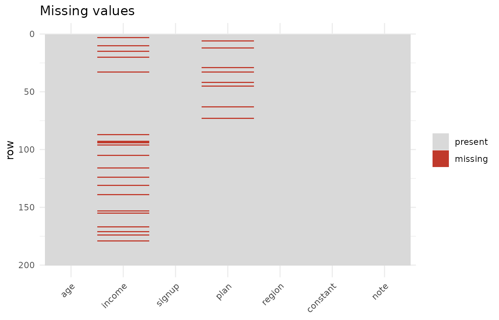
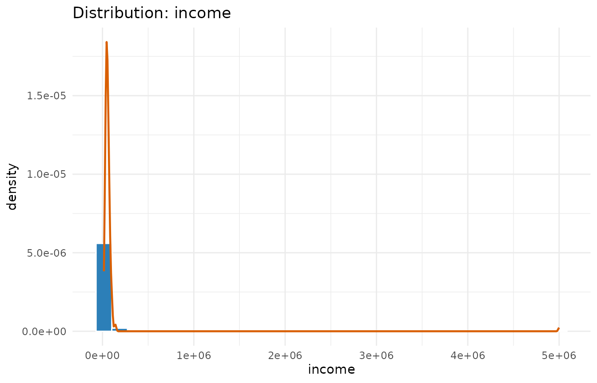
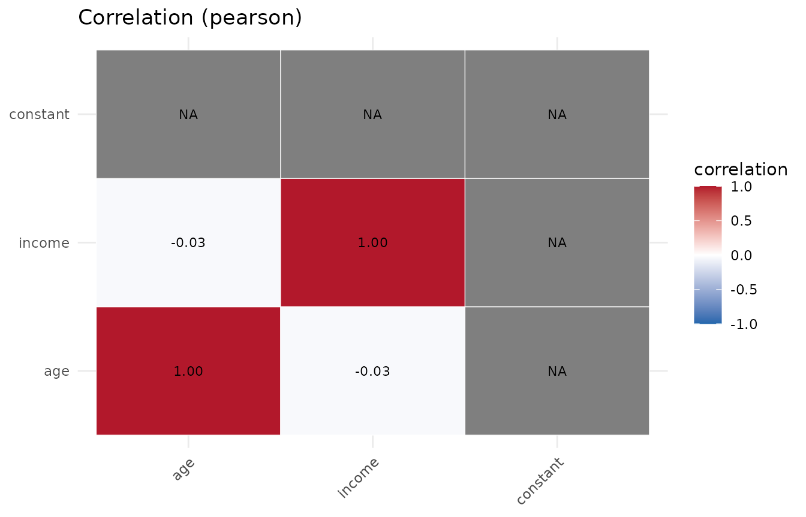
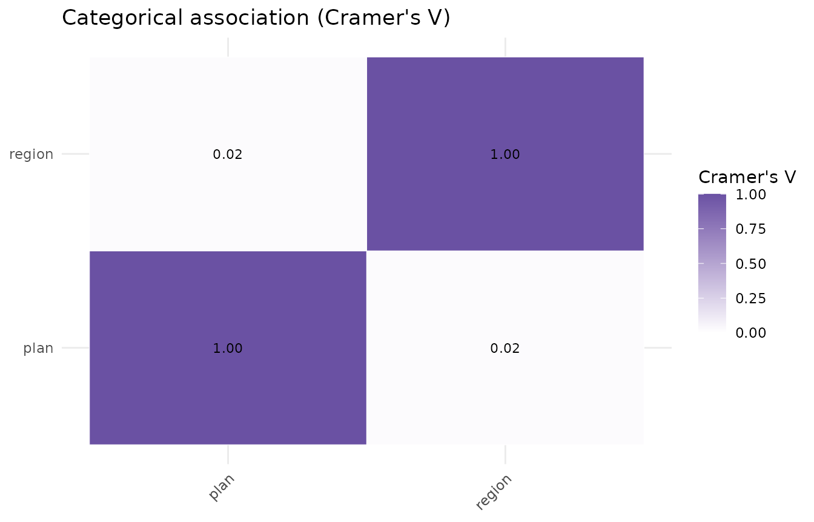

# Profiling a dataset with dataProfilerR

`dataProfilerR` turns a data frame into a structured profile with one
call: type inference, missing-value analysis, summary statistics,
normality tests, outlier detection, correlation, a data-quality score,
and `ggplot2` figures.

``` r

library(dataProfilerR)
```

## A deliberately messy dataset

To show what the profiler surfaces, here is a small frame with missing
values, an outlier, a constant column, and a high-cardinality text
column.

``` r

set.seed(1)
n <- 200
df <- data.frame(
  age        = round(rnorm(n, 40, 12)),
  income     = c(rlnorm(n - 1, log(50000), 0.4), 5e6),   # one extreme outlier
  signup     = as.Date("2025-01-01") + sample(0:600, n, replace = TRUE),
  plan       = sample(c("free", "pro", "enterprise"), n, replace = TRUE),
  region     = sample(c("NA", "EU", "APAC"), n, replace = TRUE),
  constant   = 1L,                                        # zero-variance column
  note       = replicate(n, paste(sample(letters, 12), collapse = "")),
  stringsAsFactors = FALSE
)
df$income[sample(n, 20)] <- NA          # inject missingness
df$plan[sample(n, 8)]    <- NA
```

## One call to profile it

``` r

p <- profile_data(df, dataset_name = "customers")
#> Warning in stats::cor(num_df, use = "pairwise.complete.obs", method = m): the
#> standard deviation is zero
#> Warning in stats::cor(num_df, use = "pairwise.complete.obs", method = m): the
#> standard deviation is zero
#> Warning in stats::cor(num_df, use = "pairwise.complete.obs", method = m): the
#> standard deviation is zero
#> Warning in stats::cor(num_df, use = "pairwise.complete.obs", method = m): the
#> standard deviation is zero
p
#> <data_profile>
#>   dataset : customers
#>   size    : 200 rows x 7 columns
#>   types   : categorical=2, date=1, integer=1, numeric=2, text=1
#>   missing : 2.0% of cells; 86.5% of rows complete
#>   quality : 96.2 / 100 (grade A)
#>   most missing: income (10.0%), plan (4.0%)
#>   use summary() for details and plot() for figures.
```

[`print()`](https://rdrr.io/r/base/print.html) gives the headline:
dimensions, type breakdown, missingness, and the quality score. Note the
score is below 100 – the missingness and the constant column both cost
points.

## Drilling in with summary()

``` r

summary(p)
#> Data profile for 'customers' (200 x 7), quality 96.2 (A)
#> 
#> -- numeric summary --
#>    column   n n_missing      mean        sd     variance      min       q1
#>       age 200         0    40.385     11.15 1.243180e+02    13.00    33.00
#>    income 180        20 82158.549 369253.45 1.363481e+11 15743.93 40392.28
#>  constant 200         0     1.000      0.00 0.000000e+00     1.00     1.00
#>    median       q3     max      iqr skewness kurtosis
#>     39.00    47.00      69    14.00    0.190   -0.199
#>  50065.35 67074.75 5000000 26682.47   13.233  173.753
#>      1.00     1.00       1     0.00       NA       NA
#> 
#> -- columns with missing values --
#>  column n_missing pct_missing
#>  income        20          10
#>    plan         8           4
#> 
#> -- normality (Shapiro-Wilk) --
#>    column n_used shapiro_p normal
#>       age    200  3.93e-01   TRUE
#>    income    180  9.16e-29  FALSE
#>  constant    200        NA  FALSE
#> 
#> -- outliers (iqr) --
#>    column n_outliers  pct
#>       age          1 0.50
#>    income          4 2.22
#>  constant          0 0.00
#> 
#> -- strongest correlations (pearson) --
#>    var1     var2 correlation
#>     age   income      -0.035
#>     age constant          NA
#>  income constant          NA
#> 
#> -- date columns --
#>  column   n n_missing        min        max range_days n_unique max_gap_days
#>  signup 200         0 2025-01-03 2026-08-24        598      167           16
#> 
#> -- categorical association (Cramer's V) --
#>        plan region
#> plan   1.00   0.02
#> region 0.02   1.00
```

The numeric summary shows `income` is heavily right-skewed (large
positive skewness and kurtosis) thanks to the injected outlier, and the
outlier table flags it. `age` looks roughly symmetric.

## The object is just a list

Everything is accessible directly, which makes the profile easy to use
programmatically:

``` r

p$metadata$column_types
#>           age        income        signup          plan        region 
#>     "numeric"     "numeric"        "date" "categorical" "categorical" 
#>      constant          note 
#>     "integer"        "text"
p$diagnostics$quality$components
#> completeness   uniqueness  variability  cleanliness 
#>         98.0        100.0         85.7         99.1
head(p$statistics$numeric[, c("column", "mean", "sd", "skewness")])
#>     column      mean           sd   skewness
#> 1      age    40.385     11.14981  0.1904266
#> 2   income 82158.549 369253.44951 13.2334718
#> 3 constant     1.000      0.00000         NA
```

## Figures

The figures are built during
[`profile_data()`](https://mqfarooqi1.github.io/dataProfilerR/reference/profile_data.md)
and retrieved with
[`plot()`](https://rdrr.io/r/graphics/plot.default.html).

``` r

plot(p, which = "missing")
```



``` r

plot(p, which = "distribution", column = "income")
```



``` r

plot(p, which = "correlation")
```



You can also call the plotting functions directly without a full
profile, e.g. `plot_boxplots(df)` or
`plot_pairs(df, c("age", "income"))`.

## Tuning the run

- `build_plots = FALSE` skips figure construction on very wide data.
- `outlier_method` can be `"iqr"` (default), `"zscore"`, or `"robust"`
  (median/MAD).
- `cor_method` accepts `"pearson"`, `"spearman"`, or both.
- `normality = FALSE` skips the Shapiro-Wilk / Anderson-Darling tests.

``` r

p2 <- profile_data(df, build_plots = FALSE, outlier_method = "robust",
                   cor_method = "spearman")
#> Warning in stats::cor(num_df, use = "pairwise.complete.obs", method = m): the
#> standard deviation is zero
#> Warning in stats::cor(num_df, use = "pairwise.complete.obs", method = m): the
#> standard deviation is zero
#> Warning in stats::cor(num_df, use = "pairwise.complete.obs", method = m): the
#> standard deviation is zero
p2$diagnostics$outliers$per_column
#>     column n_outliers  pct
#> 1      age          0 0.00
#> 2   income          3 1.67
#> 3 constant          0 0.00
```

## Beyond correlation (0.2.0)

Categorical columns get their own association matrix (Cramer’s V):

``` r

p$statistics$association
#>              plan     region
#> plan   1.00000000 0.02227124
#> region 0.02227124 1.00000000
plot(p, which = "association")
```



Date columns are profiled for range and gaps:

``` r

p$diagnostics$dates
#>   column   n n_missing        min        max range_days n_unique max_gap_days
#> 1 signup 200         0 2025-01-03 2026-08-24        598      167           16
```

And you can compare the numeric columns across the levels of a factor:

``` r

pg <- profile_data(df, group_by = "plan")
#> Warning in stats::cor(num_df, use = "pairwise.complete.obs", method = m): the
#> standard deviation is zero
#> Warning in stats::cor(num_df, use = "pairwise.complete.obs", method = m): the
#> standard deviation is zero
#> Warning in stats::cor(num_df, use = "pairwise.complete.obs", method = m): the
#> standard deviation is zero
#> Warning in stats::cor(num_df, use = "pairwise.complete.obs", method = m): the
#> standard deviation is zero
head(pg$diagnostics$groups$numeric_by_group, 8)
#>        group   column  n n_missing         mean           sd   median
#> 1 enterprise      age 70         0     40.87143     11.82103    40.50
#> 2 enterprise   income 63         7  53494.38196  20892.25942 49893.23
#> 3 enterprise constant 70         0      1.00000      0.00000     1.00
#> 4       free      age 59         0     40.16949     11.88907    40.00
#> 5       free   income 54         5  56576.18404  21851.55117 52620.50
#> 6       free constant 59         0      1.00000      0.00000     1.00
#> 7        pro      age 63         0     40.12698     10.23985    39.00
#> 8        pro   income 56         7 140692.97488 661501.68118 47833.91
```

## A full HTML report

[`report()`](https://mqfarooqi1.github.io/dataProfilerR/reference/report.md)
renders everything above – tables and figures – into one self-contained
HTML file. It needs pandoc (the usual R Markdown dependency).

``` r

report(p, "customers_report.html")
```
